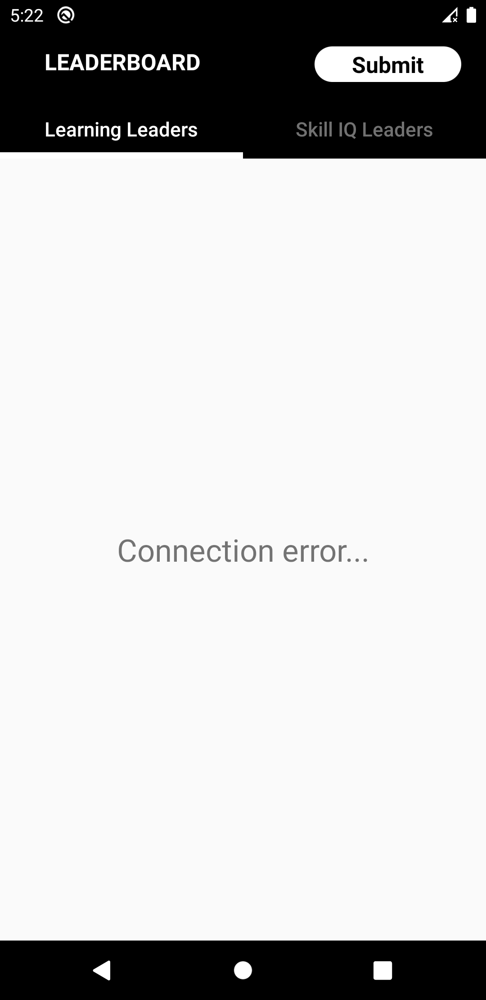
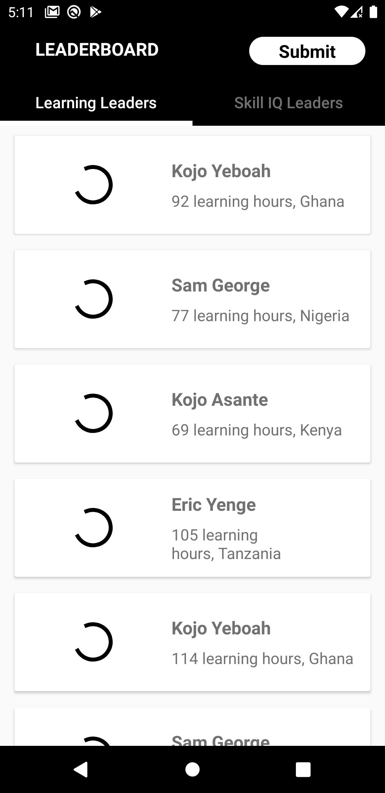
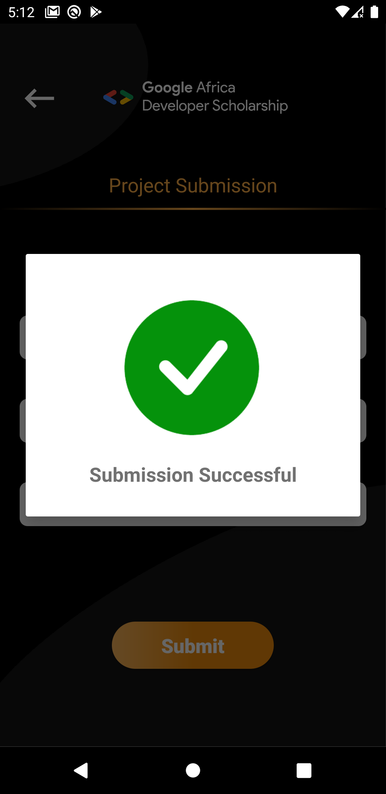

# Google Africa Developer Scholarship Phase II (GADS 2020)
# Associate Android Developer Practice Project (AADPP)

Building a GADS Leaderboard Mobile Application
Description
This project is a very simple Android Project aimed at getting you to implement some simple concepts that are very important as far as Android Development is concerned.

In this project, you are going to implement a mobile design of the GADS 2020 Leaderboard. The mobile App will display 
1 - Top 20 learners in the Learning Leaders’ category 
2 - Top 20 learners in the Skill IQ Leaders’ category.

This project will help you understand:

Multi-Activity Project
View pager
Customizing Toolbar
RecyclerView
Making Network Request
Working with Google Form and many more...

Resources
The data for your List should be gotten by making a network request the following API endpoints:

Base URL https://gadsapi.herokuapp.com The data is in json format.
Learning Leaders - /api/hours
Skill IQ Leaders - /api/skilliq

The submission will be done through the App. Before submitting the project, it should pushed to GitHub and include screenshots of your App in the Repo.

To submit your project
Make a NETWORK POST request to this Google Form using any network library. [Retrofit is recommended.]
Base url - https://docs.google.com/forms/d/e/
Form ID-1FAIpQLSf9d1TcNU6zc6KR8bSEM41Z1g1zl35cwZr2xyjIhaMAz8WChQ/formResponse
FullURL- https://docs.google.com/forms/d/e/1FAIpQLSf9d1TcNU6zc6KR8bSEM41Z1g1zl35cwZr2xyjIhaMAz8WChQ/formResponse
Entries IDs:
-	Email Address   = entry.1824927963
-	Name            = entry.1877115667
-	Last Name       = entry.2006916086
-	Link to project = entry.284483984

You can also find all resources and designs needed for this project here
https://drive.google.com/drive/folders/1l-huMnFzu0Lh_olBCzHgovsUCwbKouMb

### Screenshots

| Splash Screen	 | Loading Learners  | Connection Error |
| :-----: | :-: | :-: |
|  |   |  |

| No Data Available	 | Loading Top Learners  | Top Learners |
| :-----: | :-: | :-: |
|  |   |  |

| Loading Skilled IQ Learners	 | Skilled IQ Learners  | Submit Project Screen |
| :-----: | :-: | :-: |
|  |   |  |

| Submit Project	 | Submit Project Loading | Submission Project Successful |
| :-----: | :-: | :-: |
|  |   |  |

| Submission Project Failed |
| :-----: |
|  |

